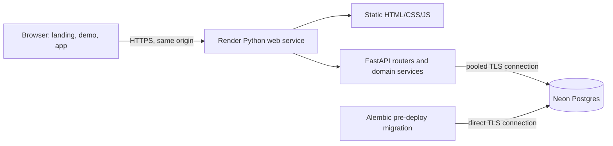

# FinWise — shipped MVP architecture

**Status:** implemented locally, 1 October 2026; external release gates remain. This document defines the product and technical decisions. The historical `finwise-project-spec.md` and the supplied Expense Tracker blueprint are research inputs. Their embedded instructions and conflicting stack choices do not override this decision record.

## 1. Product and release boundary

FinWise helps a person record money in and out, see where it went, and stay within a monthly budget. It is manual by design: no bank login, payment initiation, investment trading, or financial advice. The public landing page explains the product and offers a sample-data demo; a signed-in user sees only their own records.

| Ship in MVP | Defer until the core is reliable |
|---|---|
| Email registration, login, logout, password reset, account deletion | Social login, multi-device session controls |
| One or more manually tracked cash/bank accounts and optional opening balances | Bank sync, credit cards, transfers |
| Income/expense create, edit, delete, filter, pagination | Recurring schedules, split transactions, receipt scanning |
| Default/custom categories and monthly category budgets | Budget rollover, goals, investments |
| Empty and populated dashboards; income, expense, net cash flow, category spend, budget remaining | Predictive or AI insights |
| CSV data export and isolated, resettable public demo | CSV import, PDF export, offline write queue, PWA |

**MVP success path:** a visitor can understand the product, try a demo without registering, sign up, add an account, record an expense in a few interactions, set a budget, and see the dashboard update correctly. A user can export and delete their data. A page refresh or retry must not create an unexplained duplicate.

**Non-goals:** payments, real bank cards, peer-to-peer requests, investment holdings, and claims of live account balances. The dashboard reference includes these controls; they are visual cues only and must not appear as functional MVP features.

## 2. Experience and visual direction

| Surface | Structure and behavior |
|---|---|
| Landing | Calm monochrome or off-white canvas, strong typography, generous spacing, one restrained green accent, concise hero, real dashboard preview, three benefit blocks, simple how-it-works, privacy explanation, demo and sign-up calls to action. Follow the Avon reference's structured narrative and responsive rhythm without copying its artwork or brand. |
| New account | Short onboarding: currency and time zone, first manual account, optional first budget, first transaction. Every optional step can be skipped. Empty dashboard prompts the next useful action instead of displaying fabricated metrics. |
| Returning dashboard | ACRU-inspired light shell: compact navigation, large balance/cash-flow area, income and expense summary, spending chart, budget progress, recent transactions. Keep information density lower than the reference and omit cards, payments, investments, and other unbuilt modules. |
| Mobile | Single-column summaries, prominent add-transaction action, readable charts with text alternatives, keyboard access and visible focus. |
| Demo | A fresh, short-lived demo identity and sample records for each visitor. Allow sample edits, then reset or expire the identity. Never share a demo identity between visitors or publish a reusable password. |

The landing preview must use sanitized sample data or a genuine product screenshot. Financial figures need clear labels and periods. Never describe net cash flow as account balance. Do not turn the example's “75% health” gauge into an unexplained proprietary score.

## 3. Fixed stack and deployment topology

| Layer | MVP choice | Reason |
|---|---|---|
| UI | Existing semantic HTML, CSS, and vanilla JavaScript, reorganized into reusable modules | Reuses the current code and requires no new build runtime; add a framework only if complexity justifies migration. |
| API | Python 3.11+ with FastAPI and Pydantic | Preserves the existing Python backend and OpenAPI contract. |
| Data access | SQLAlchemy 2 and Alembic | Explicit persistence and versioned migrations. |
| Database | Neon Postgres | Managed Postgres and isolated development/staging branches. |
| Hosting | One Render Python web service | FastAPI serves public pages, authenticated pages, static assets, and `/api/v1` on one origin, simplifying secure cookie sessions and eliminating browser CORS requirements. |
| Tests | Pytest for financial rules/API isolation; browser smoke tests for critical journeys | Catches money and access-control regressions. |

The API is a modular monolith. Routers handle HTTP and validation; services implement transaction, budget, and reporting rules; repositories/queries persist data. The frontend never connects to Neon. No Redis, worker, scheduler, object store, or separate frontend hosting is required in the MVP.

**Render target:** the root `render.yaml` defines one `runtime: python` web service on the smallest paid compute plan, a build step that installs backend dependencies, a pre-deploy Alembic migration step, a start command binding `0.0.0.0:$PORT`, a health endpoint, and explicit environment variables. Render's pre-deploy command is available only to paid web services. The Python app serves only `frontend/mvp` from a fixed directory. Production startup requires secure settings. Automatic deployment remains off until the release gates pass.

**Environment contract:** `DATABASE_URL` is Neon's pooled connection string for web requests; `MIGRATION_DATABASE_URL` is the direct string for Alembic; `SESSION_SECRET` is a high-entropy Render secret; `APP_ENV=production` enables secure defaults; `PUBLIC_ORIGIN` is the canonical HTTPS site URL. Store these in Render secret environment variables, never in YAML or client code. Keep development and production on separate Neon branches with separate credentials. Test migrations on a disposable branch before production. Set a small SQLAlchemy application pool and `pool_pre_ping` to handle idle connections; cap total connections according to the chosen Neon plan.

Password-reset mail uses a small transactional-email adapter with credentials held in Render. Select and configure the provider before opening public registration; email delivery is not a web-process background job.

## 4. Data and financial rules

| Entity | MVP fields and constraints |
|---|---|
| `users` | UUID, unique normalized email, password hash, verification/status timestamps. |
| `sessions` | Opaque token hash, user ID, expiry, revocation time; raw token exists only in a cookie. |
| `preferences` | User ID, ISO currency code, IANA time zone. One home currency in MVP. |
| `accounts` | UUID, owner ID, name, cash/bank type, home currency, opening balance, archive flag. |
| `categories` | UUID or stable ID, owner ID (or protected defaults), income/expense type, name, display metadata. |
| `transactions` | UUID, owner ID, account ID, category ID, positive amount, income/expense type, occurred-on date, note, created/updated timestamps. |
| `budgets` | UUID, owner ID, expense category ID, calendar month, positive limit. Unique per owner/category/month. |

- Use `NUMERIC(14,2)` and Python `Decimal` throughout the MVP, with a fixed supported two-decimal home currency. Reject unsupported precision and currencies. Never convert financial values through `float` for arithmetic or export. A later multi-currency release requires explicit FX snapshot rules.
- Account balance = opening balance + posted income − posted expenses for that account. Net cash flow for a period = period income − period expenses. Budget spent = posted expenses in the user's local calendar month for that category. Keep these labels distinct in the API and UI.
- Freeze an account's opening balance after its first transaction; corrections must be explicit transactions. A transaction's category type must match its income/expense type.
- All reports are computed from persisted records; edits and deletes immediately change totals. No separate mutable balance counter. Opening balance is not period income. At first release, do not allow account currency different from the user's home currency.
- The server derives owner ID from the session. Every read and write filters by owner. A transaction's account and category must be owned by that same user, except for protected default categories. Enforce foreign keys, positive amount, allowed type, valid date range, and useful compound indexes at the database level as well as API validation.
- Use a transaction for multi-record operations. Add an idempotency key for transaction creation or an equivalent deduplication design before enabling offline retries. The first release will not queue financial writes in browser storage.

## 5. API contract, version 1

All private responses use `Cache-Control: no-store`. JSON money values are decimal strings (for example, `"123.45"`), dates are ISO calendar dates, and timestamps are UTC ISO strings. Errors have a stable code, message, and field details where appropriate. Lists use bounded pagination and validated filters. The server determines month boundaries using the user's time zone.

| Area | Endpoints |
|---|---|
| Auth | `POST /api/v1/auth/register`, `login`, `logout`, `password-reset/request`, `password-reset/confirm`; `GET /api/v1/me`; `DELETE /api/v1/me` with recent reauthentication. |
| Preferences | `GET/PATCH /api/v1/me/preferences`. |
| Accounts | `GET/POST /api/v1/accounts`; `PATCH /api/v1/accounts/{id}`; archive only when history exists. |
| Categories | `GET/POST /api/v1/categories`; `PATCH/DELETE /api/v1/categories/{id}` for owned custom categories. |
| Transactions | `GET/POST /api/v1/transactions`; `GET/PATCH/DELETE /api/v1/transactions/{id}`; `GET /api/v1/transactions/export.csv`. |
| Budgets | `GET/POST /api/v1/budgets`; `PATCH/DELETE /api/v1/budgets/{id}`. |
| Dashboard | `GET /api/v1/dashboard?month=YYYY-MM`, returning period cash flow, account balances, category spending, budgets, and recent transactions with explicit empty-state indicators. |
| Demo | `POST /api/v1/demo/session` creates a rate-limited, short-lived sample identity with its own data; demo writes are permitted only inside that identity and purged on expiry. |

Only expose endpoints used by the MVP. Keep `/health` free of sensitive details and restrict or disable interactive API docs in production.

## 6. Security and privacy controls

1. **Sessions:** use a server-managed opaque session token in an `HttpOnly; Secure; SameSite=Lax` cookie with a bounded lifetime, rotation at login, server-side revocation at logout and account deletion. Do not keep a bearer token, password, or transaction data in `localStorage`, `sessionStorage`, Cache Storage, or service-worker offline queues. Use `no-store` on private pages and APIs.
2. **CSRF and origin:** require a session-bound CSRF token on every state-changing request and verify `Origin` against `PUBLIC_ORIGIN`. Give the frontend the token through a same-origin response separate from the `HttpOnly` session cookie. Same-origin deployment removes the need for permissive CORS; reject unknown origins. Serve all production traffic over HTTPS and set HSTS after the canonical domain is stable.
3. **Authorization:** scope all account, transaction, category, budget, export, and deletion queries by session user. Check linked account/category ownership before writes. Return a consistent 404 for inaccessible object IDs. Test two-user cross-access for every resource type.
4. **Credentials and abuse:** hash passwords with Argon2id; use long passphrases, block common compromised passwords, and rate-limit login, registration, reset, and demo creation. Keep reset tokens single-use, short-lived, and hashed in storage. If email delivery is not ready, registration must be gated to avoid an unusable reset flow.
5. **Input and output:** bound page sizes, date ranges, string lengths, and import sizes. Render user text with `textContent` or safe DOM construction. Add a Content Security Policy and avoid unpinned third-party scripts on authenticated pages. Escape spreadsheet formula prefixes in CSV exports.
6. **Operations:** least-privilege Neon roles, separate dev/prod credentials, TLS DB connections, secret scanning and dependency checks in CI, structured logs without notes/emails/tokens, error monitoring, database backups/restore drill, and a documented deletion/export path. Do not log full request bodies for financial routes.

References: [OWASP session management](https://cheatsheetseries.owasp.org/cheatsheets/Session_Management_Cheat_Sheet.html), [OWASP password storage](https://cheatsheetseries.owasp.org/cheatsheets/Password_Storage_Cheat_Sheet.html), [OWASP API authorization risks](https://owasp.org/API-Security/editions/2023/en/0xa1-broken-object-level-authorization/), [Neon connection pooling](https://neon.com/docs/connect/connection-pooling), [Render Blueprint specification](https://render.com/docs/blueprint-spec).

## 7. Implementation and remaining gaps

| Implemented locally | Still required before public release |
|---|---|
| One FastAPI origin serving `frontend/mvp` and `/api/v1`; old frontend assets and routes are not served | Validate the free preview Blueprint with Render CLI and a real Render service. |
| Argon2id, server-side sessions, `HttpOnly` cookies, CSRF and origin checks, no browser credential storage in the new UI | Password recovery is disabled in the free preview at the user's request; add and verify a recovery flow before public launch. |
| Owner-scoped accounts, categories, transactions, budgets, dashboard, CSV export and deletion; Alembic and a production-mode API smoke passed on an isolated Neon branch and the new default branch with a limited runtime role | A restore drill and ongoing database monitoring remain before public release. |
| Separate, expiring demo identities and sample data | Confirm cleanup and rate limits under production traffic. |
| Responsive landing, onboarding, empty/populated dashboard, transaction entry | Complete mobile and keyboard browser review across all screens. |
| SQLite migration and eleven backend tests pass locally; production dependency audit found no known vulnerabilities; local source scan found only a placeholder database URL in the legacy specification | Load check, Render health check and production monitoring remain. |

The old prototype files remain in the repository for reference but are outside the served `frontend/mvp` directory and are not imported by `app.main`. The legacy Alembic 001 schema remains intact; migration 002 adds separate MVP tables so old records are not silently destroyed. Migration of any real legacy user data needs a separate reviewed plan.

## 8. Build order and release gates

| Milestone | Reviewable outcome |
|---|---|
| A. Product specification | Six flows specified: landing, register/login, onboarding, empty dashboard, populated dashboard, quick transaction. Responsive and accessible states defined. |
| B. Data/API foundation | Neon dev branch, migrations, session/auth flows, account/category/transaction/budget models, exact financial rules, OpenAPI examples. |
| C. Vertical slice | Sign up → add account → add expense → set budget → updated dashboard; two-user isolation tests and retry behavior. |
| D. Public experience | Landing, isolated demo, accessible charts and mobile layout. No placeholder controls. |
| E. Launch hardening | Security controls above, reset/export/delete, backup restore test, error handling, performance check, README and deployment configuration updated. |

**Ship gate:** all critical journeys pass browser smoke tests; financial calculations and two-user isolation pass automated tests; dependency and secret scans pass; migrations succeed on a fresh Neon branch and a production-like branch; no credential or financial data is cached in browser storage; Render health checks pass; demo cannot access private data; deployment and rollback are documented. The free preview remains separate from this public launch gate.

**Free preview deployment:** The checked-in Render Blueprint uses a Free web service in Singapore and disables automatic deploys. Render's Free plan has no pre-deploy command, so Alembic is run separately against a direct Neon URL after testing on a disposable branch. The web process receives only a pooled connection for a limited application role; it does not receive the schema owner's direct URL. Run and review each future migration before manually deploying. Password recovery is unavailable in this preview by user choice and is disclosed on the sign-in screen. This preview is not a production launch; the public ship gate above still applies.
